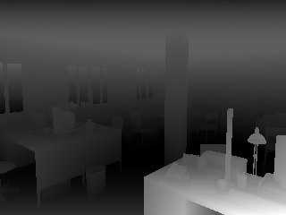
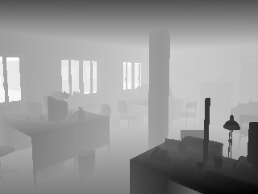

# Project's goals

The goal of this project is to provide an easy-to-install python toolbox that can be used to easily generate synthetic training and testing data for various computer-vision problems such as stereo reconstruction, optical flow, multiview reconstruction, structure from motion, point and segment matching, single view surface normals estimation or shape from shading.

The synthetic images are obtained through the generation of a random 3D scene using  that is rendered using the open-source ray-tracer called povray trough a simple python interface to povray called [vapory](https://github.com/Zulko/vapory).
The povray ray tracer is patched using [vlpovutils](https://github.com/devernay/vlpovutils) to allow the obtention of the disparity map in case of stereo pairs generation. 

Generating synthetic data allows us 

* to have a complete control on the type a scenes we want to specialize our algorithm on, For example we can generate scenes that piecewise planar and that are manahattan or not. We have a control on the surface properties (lambertian  or with specularities) and we can control the amount and type of textures. 

* to generate data in large quantities (assuming you have enough computational ressources) 

* to have perfect ground truth with no measure error, that can be usefull when checking that there are no bugs in your stereo or optical flow code. 

 
## Examples

synthetic stereo pairs
 
left image:

 
 
right image:

left image:

right image:

disparity: 

# Limitations

The scenes are generated in the pov-ray format using a constructive solid geometry (CSG) description of the surface i.e. using unions and differences of basic 3D shapes such as sphere cubes etc and thus there is no triangulated surface description of the scene. This can be a problem if one wants to use the triangulated surface to generate disparity maps or displacement fields.
This could be overcome by allowing the user the generate random scene that are triangulated surfaces, either by generating directly triangulated surfaces or by converting the CSG into a triangulated surface before rendering and by giving access to the triangulated surface to the user. 
However  i could not find tool to generate meshes from povrayfile (which would require some solid-geometry-to-mesh tool such as  openSCAD or [solidPython](https://github.com/SolidCode/SolidPython)). 

An approach would consist in using only meshed and no solid geometry , and then use CGAL to generate the depth map using raytracing in CGAL, or use some other renderer that gives access to the zbuffer.
This has the advantage of beeing more flexible that using a pached version of povray and would allow to get disparities in  hidden parts too. 

# References and links

synthetic office and living room images + depth [here](http://www.doc.ic.ac.uk/~ahanda/VaFRIC/iclnuim.html)
the paper describing the image generation process can be found [here](http://www.doc.ic.ac.uk/~ahanda/VaFRIC/icra2014.pdf)
it has been generated wit POVray http://www.povray.org/
improved version of thes synthetic data with additional what can be found [here](http://redwood-data.org/indoor/dataset.html)
explaination on how to create a camera paramterized as usually done in computer vision in povray in [here](http://www.inf.u-szeged.hu/projectdirs/kepaf2011/pdfs/S07_02.pdf)
gettign data from http://robotvault.bitbucket.org/
but there is no texture for now...

# Install

* install POVray 3.7  See [here](http://www.povray.org/download/) for the Windows binaries. For Linux/MacOS you must compile the source or you can use 

	sudo apt-get install povray  

* install vaporay a python interface to POVray	

	pip install vapory

Note vapory calls povray , we could modify it to call the patched version of megapov (see below) in order to generate the dpeth file and recover the depth information in a numpy array.
we can cheat by overwritting the povray executable by a link to the patched magapov executable

	sudo ln -s /usr/local/bin/megapov /usr/local/bin/povray

we need then to look for the depth file in the temp folder ?

# Getting the disparity map

In order to obtain a ground truth disparity map associated to a synthetic stereo pair of image, you will need to use a patched version of megapov using [vlpovutils]((https://github.com/devernay/vlpovutils) (original page [here](http://devernay.free.fr/hacks/povray/vlpovutils/)), with megapov beeing already a modified version of povray.
There are example of data that have been generated using this tool:
* the povray office with depth maps [here](http://devernay.free.fr/vision/focus/office/)
* a patio [here](http://devernay.free.fr/vision/focus/patio/) 
the use of the vlpovutils code to generate depths maps is not very well documented . all the links i found to the annotation patch by Dr Andrea Vedaldi point to [this](http://www.robots.ox.ac.uk/~vedaldi/code/vlpovy.html) page that does not exist anymore 
maybe the most detailed instruction are the office and patio pages

## Installation

following instructions from the readme in https://github.com/devernay/vlpovutils/tree/master/povray

### getting the patches from vlpovutils

we first download the vlpovutils source code that contains the patches that we will apply to povray and megapov

	wget http://github.com/devernay/vlpovutils/archive/71890a3acc8501f674795285aa69669f15c95f69/master.zip --no-check-certificate
	unzip master.zip
	rm master.zip 

### installing libpng 1.5

compiling povray 3.6 requires libpng 1.5. The version we get in january 2015 through apt-get is libpng12, so we need to compile libpng 1.5

	wget http://sourceforge.net/projects/libpng/files/libpng15/1.5.26/libpng-1.5.26.tar.gz
	tar xf libpng-1.5.26.tar.gz	
	cd libpng-1.5.26
	./configure --prefix=/usr/local/libpng
	make check
	sudo make install
	make check
	sudo updatedb
	sudo ln -s /usr/local/libpng/lib/libpng15.so.15 /usr/lib/libpng15.so.15
	sudo ln -s /usr/local/libpng/lib/libpng15.so.15 /usr/local/libpng/lib/libpng12.so

### installing patched povray 3.6

note:  sudo apt-get install povray  installs povray 3.7 while megapov requires povray 3.6. It would be good to update megapov. 
However on this vlpovutils page [here](http://devernay.free.fr/vision/focus/office/) it is said thayt they uses 
 POV-Ray 3.7 RC6 as POV-Ray 3.6 generates visible artifacts between the left and right views.
How did he manage to install megapov 1.2.1 with povray 3.7 -

	wget http://www.povray.org/ftp/pub/povray/Old-Versions/Official-3.62/Unix/povray-3.6.1.tar.bz2
	tar -jxjf povray-3.6.1.tar.bz2
	cd povray-3.6.1/
	patch -p1 < ../vlpovutils-master/povray/megapov-focalblur.patch	
	patch -p0 < ../vlpovutils-master/povray/povray-3.6.1-png15.patch
	export CPPFLAGS=-I/usr/local/libpng/include
	export LDFLAGS=-L/usr/local/libpng/lib
	./configure --prefix=/opt/megapov --with-x COMPILED_BY="martin.de-la-gorce@enpc.fr" 
	make
	sudo make install 
	sudo sed -i 's/;none /none /g' /opt/megapov/etc/povray/3.6/povray.conf
	sudo sed -i 's/restricted /;restricted /g' /opt/megapov/etc/povray/3.6/povray.conf

you should now have a povray executable in the sub folder unix/megapov and in /opt/megapov/bin

Remark :

if we do not use the lines 
	export CPPFLAGS=-I/usr/local/libpng/include
	export LDFLAGS=-L/usr/local/libpng/lib
we get the following error
	png_pov.cpp:1352:96: error: ‘png_get_current_row_number’ was not declared in this scope
   line_number = png_get_y_offset_pixels(png_ptr, info_ptr) + png_get_current_row_number(png_ptr);

### installing patched megapov 1.2.1 and vlpovutils

	wget http://megapov.inetart.net/packages/unix/megapov-1.2.1.tgz
	tar -zxvf megapov-1.2.1.tgz
	cd megapov-1.2.1/
	patch -p1  < ../vlpovutils-master/povray/megapov-annotation-0.2.patch 
	patch -p1 < ../vlpovutils-master/povray/megapov-focalblur.patch
	patch -p1 < ../megapov-png15.patch
	export CPPFLAGS=-I/usr/local/libpng/include
	export LDFLAGS=-L/usr/local/libpng/lib
	./configure --prefix=/opt/megapov --with-x COMPILED_BY="martin.de-la-gorce@enpc.fr"  --disable-lib-checks 

	make 
	sudo make install

you should now have a megapov executable in the sub folder unix/megapov and in /opt/megapov/bin
copying executable and default options file after modification
	
	sudo cp /opt/megapov/bin/megapov /usr/local/bin
	sudo sed -i 's/;none /none /g' /opt/megapov/etc/megapov/1.2.1/povray.conf
	sudo sed -i 's/restricted /;restricted /g' /opt/megapov/etc/megapov/1.2.1/povray.conf
	sudo sed -i '$ a\ Library_Path="/opt/megapov/share/povray-3.6"' /opt/megapov/etc/megapov/1.2.1/povray.ini
	sudo sed -i '$ a\ Library_Path="/opt/megapov/share/povray-3.6/ini"' /opt/megapov/etc/megapov/1.2.1/povray.ini
	sudo sed -i '$ a\ Library_Path="/opt/megapov/share/povray-3.6/include"' /opt/megapov/etc/megapov/1.2.1/povray.ini
	sudo chmod  777 /usr/local/bin/megapov
	sudo mkdir ~/.megapov
	sudo mkdir ~/.megapov/1.2.1/
	sudo cp /opt/megapov/etc/megapov/1.2.1/povray.ini ~/.megapov/1.2.1/povray.ini
	sudo cp /opt/megapov/etc/megapov/1.2.1/povray.conf ~/.megapov/1.2.1/povray.conf

### compiling lpov_motionfield2

	cd vlpovutils-master
	sudo apt-get install libboost-dev libboost-test-dev
	sed -i 's/CXXFLAGS=/CXXFLAGS= -std=c++11 /g' Makefile	
	make
	sudo cp vlpov_motionfield2 /usr/local/bin
	sudo chmod  777 /usr/local/bin/vlpov_motionfield2

## testing 

following the example from [here](http://devernay.free.fr/vision/focus/office/) i'm trying to generate a stereo pair with the corresponding disparity map
we first fetch the data and create folder

	mkdir data
	cd data
	mkdir office
	cd office
	wget http://devernay.free.fr/vision/focus/office/office-focalblur.zip
	unzip -a office-focalblur.zip
	cd office-focalblur
	wget  http://www.ignorancia.org/uploads/zips/office.zip
	unzip -a office.zip
	wget  http://www.ignorancia.org/uploads/zips/lightsys4c.zip
	unzip -a lightsys4c.zip
	wget http://www.ignorancia.org/uploads/zips/bookplacer.zip
	unzip -a bookplacer.zip
	wget http://www.ignorancia.org/uploads/zips/meshlath.zip
	unzip -a meshlath.zip	
	mkdir office-left office-right
	
we render the scene with very low quality in order to quickly get the depth information

	megapov +Q0 -UV +w320 +h240 -A +L. +L./office +L./office/maps +L./LightsysIV +L./office-left +K0.0 +Ioffice_stereo_megapov.pov +Ooffice_stereo1_megapov.png
	megapov +Q0 -UV +w320 +h240 -A +L. +L./office +L./office/maps +L./LightsysIV +L./office-right +K1.0 +Ioffice_stereo_megapov.pov +Ooffice_stereo2_megapov.png

	

this should have create 3 files in each subfolder office-left: office_stereo1_megapov.png,office_stereo1_megapov.txt,office_stereo1_megapov.depth
and three similar files in office-right. I you don't have te txt and depth files generated you may not be calling the patched megapov version (using megapov-annotation-0.2.patch see above).
The depth file containe the distances to the camera for each pixel in a little indian floatting point format. You can visualize the depth map using read_depth.py

 

we can now get the occlusion masks 

	vlpov_motionfield2 office-left/office_stereo1_megapov office-right/office_stereo2_megapov

this creates 3 files 	office_stereo1_megapov.office_stereo2_megapov.occ.tif (occlusion mask), office_stereo1_megapov.office_stereo2_megapov.my.tif (disparity map in direction y, it should be all zeros but i get values of about 0.00001) and office_stereo1_megapov.office_stereo2_megapov.mx.tif (disparity map in direction x ? )
the disparity maps are 32bit floating point tif files which cannot be visualize in the default ubuntu image viewer, however you can read ans export them to png images using read_depth.py

We can also render the image with better qualities and different focus zones

	megapov +FN16 +Q9 -UV +w320 +h240 -A +L. +L./office +L./office/maps +L./LightsysIV +L./office-left +K0.0 +Ioffice_stereo_far.pov +Ooffice_stereo1_far.png
	megapov +FN16 +Q9 -UV +w320 +h240 -A +L. +L./office +L./office/maps +L./LightsysIV +L./office-left +K0.0 +Ioffice_stereo_near.pov +Ooffice_stereo1_near.png
	megapov +FN16 +Q9 -UV +w320 +h240 -A +L. +L./office +L./office/maps +L./LightsysIV +L./office-left +K0.0 +Ioffice_stereo_near2.pov +Ooffice_stereo1_near2.png
	megapov +FN16 +Q9 -UV +w320 +h240 -A +L. +L./office +L./office/maps +L./LightsysIV +L./office-left +K0.0 +Ioffice_stereo_far2.pov +Ooffice_stereo1_far2.png
	megapov +FN16 +Q9 -UV +w320 +h240 +A0.0 +J0.0 -A +L. +L./office +L./office/maps +L./LightsysIV +L./office-left +K0.0 +Ioffice_stereo.pov +Ooffice_stereo1_all.png
	megapov +FN16 +Q9 -UV +w320 +h240 +L. +L./office +L./office/maps +L./LightsysIV +L./office-right +K1.0 +Ioffice_stereo_far.pov +Ooffice_stereo2_far.png
	megapov +FN16 +Q9 -UV +w320 +h240 +L. +L./office +L./office/maps +L./LightsysIV +L./office-right +K1.0 +Ioffice_stereo_near.pov +Ooffice_stereo2_near.png
	megapov +FN16 +Q9 -UV +w320 +h240 +L. +L./office +L./office/maps +L./LightsysIV +L./office-right +K1.0 +Ioffice_stereo_near2.pov +Ooffice_stereo2_near2.png
	megapov +FN16 +Q9 -UV +w320 +h240 +L. +L./office +L./office/maps +L./LightsysIV +L./office-right +K1.0 +Ioffice_stereo_far2.pov +Ooffice_stereo2_far2.png
	megapov +FN16 +Q9 -UV +w320 +h240 +A0.0 +J0.0 +L. +L./office +L./office/maps +L./LightsysIV +L./office-right +K1.0 +Ioffice_stereo.pov +Ooffice_stereo2_all.png

#TODO

* modify vapory to use the patched megapov executable (or use the symbolic link trick discussed above) and add the code to read the depth map, disparity maps and occlusion map (read_depth/py) to the vapory code, to make a nice python interface. We need to add a local copy of vapory to the code to do that.

* make a script to make the full installation process easier using pip install. 

* maybe add the code of vapory, megapov and vlpovutils to the repository to make the installation easier ? 

# some models available online

we could enrich our synthetic scene using existing 3D models

archive3D.net archibase.co

website listing most webstite with a short descritpion :
	http://en.wikibooks.org/wiki/Blender_3D:_Noob_to_Pro/Sources_of_free_3D_models

http://www.blender-models.com/
	not many model in total (392items), and very few interesting for us

http://blender-archi.tuxfamily.org/Models#Chair
	quite a few furniture models, no scenes

http://archive3d.net/
	many furniture models , not blender files  no scenes

http://www.blendswap.com/blends/view/67359
	many scenes , can be filtrer by licens (CC-0 ,CC-By, CC-BY-SA) will look what these licences mean
	http://www.blendswap.com/search?term=kitchen		
	www.blendswap.com/search?term=+room

http://sketchup.google.com/3dwarehouse
	quite a few kitchen and living rooms, not really reastic models in general

http://resources.blogscopia.com
 	license : Creative Commons 3.0 Unported ( http://resources.blogscopia.com/license-2/)	
	furnitures but not complete scenes
	exemple
	contemp_living_room_sh3d.zip
	contemp_living_room_obj.zip

