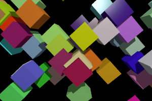
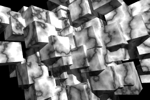
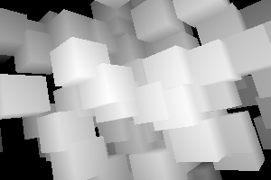
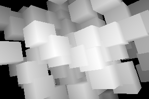
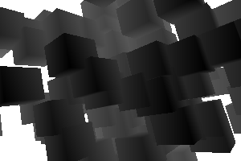
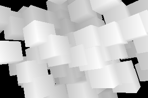
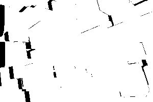
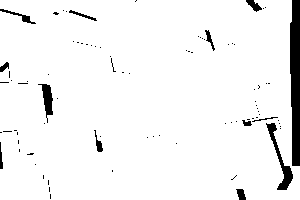

# Project's goals

The goal of this project is to provide an easy-to-install python toolbox that can be used to easily generate synthetic training and testing data for various computer-vision problems such as stereo reconstruction, optical flow, multiview reconstruction, structure from motion, point and segment matching, single view surface normals estimation or shape from shading. For now only rigid scene are handled.

The synthetic images are obtained through the generation of a random 3D scene that is rendered using the open-source ray-tracer called povray trough a simple python interface to povray called [vapory](https://github.com/Zulko/vapory).
The povray ray tracer is patched using [vlpovutils](https://github.com/devernay/vlpovutils) in order to allow the obtention of the disparity map in case of stereo pairs generation. 

Generating synthetic data allows us 

* to have a complete control on the type a scenes we want to specialize our algorithm on, For example we can generate scenes that are piecewise planar and that are manahattan or not. We have a control on the surface properties (lambertian  or with specularities) and we can control the amount and type of textures. 

* to generate data in large quantities (assuming you have enough computational ressources) 

* to have perfect ground truth with no measure error, that can be usefull to check that there are no bugs in your stereo or optical flow code. 

 
## Examples

synthetic stereo pairs

|  left image | right image  |
| ----| ---- |
|    |   |

|  left image | right image  |
| ----| ---- |
|    |   |

|  left ground truth depth  | right ground truth depth  |
| ----| ---- |
|    |   |

| left ground truth motion field |  right ground truth motion field  | 
| ----| ---- |
|    |  |

|  left occlusions  | right occlusionsd  |
| ----| ---- |
|  |   |

left disparity obtain from the pair of image and Semi global Patch matching from OpenCV: 

# Limitations

The scenes are generated in the pov-ray format using a constructive solid geometry (CSG) description of the surface i.e. using unions and differences of basic 3D shapes such as sphere cubes etc and thus there is no triangulated surface description of the scene. This can be a problem if one wants to use the triangulated surface to generate disparity maps or displacement fields.
This could be overcome by allowing the user the generate random scene that are triangulated surfaces, either by generating directly triangulated surfaces or by converting the CSG into a triangulated surface before rendering and by giving access to the triangulated surface to the user. 
However  i could not find tool to generate meshes from povrayfile (which would require some solid-geometry-to-mesh tool such as  openSCAD or [solidPython](https://github.com/SolidCode/SolidPython)). 

An approach would consist in using only meshed and no solid geometry , and then use CGAL to generate the depth map using raytracing in CGAL, or use some other renderer that gives access to the zbuffer.
This has the advantage of beeing more flexible that using a pached version of povray and would allow to get disparities in  hidden parts too. 

# Install

## linux (tested on ubuntu)

in a terminal go in the folder than contains the script install.sh and run it by typing 
	
	./install.sh

after running the script you should have the three executables

	/usr/local/bin/megapov
	/usr/local/bin/motionfield2
	/usr/local/bin/vlpov_project

and a symbolic link 
	/usr/local/bin/povray

## testing 

run the python script test_vapory.py:

	python test_vapory.py

it will create the images show in the examples above

#TODO

* modify vapory or add a layer to use the patched megapov executable (or use the symbolic link trick discussed above) and add the code to read the depth map, disparity maps and occlusion map (read_depth/py) to the vapory code, to make a nice python interface. We need to add a local copy of vapory to the code to do that.

* give a better control of the camera paramters, uncluding the focal. Maybe allows to add distortions in the camera? there are already some non conventional camera models in povray [see here](http://www.povray.org/documentation/view/3.6.1/247/)

* obtain motion field for non rigid scene. It might be quite difficult to do.

# References and links

## synthetic scene rendering

the code use to call from python the generation of the depth map using the patched version of megapov as been inspired from
following the example from [here](http://devernay.free.fr/vision/focus/office/)
 
There are synthetic office and living room images + depth [here](http://www.doc.ic.ac.uk/~ahanda/VaFRIC/iclnuim.html)

the paper describing the image generation process can be found [here](http://www.doc.ic.ac.uk/~ahanda/VaFRIC/icra2014.pdf)
it has been generated wit POVray http://www.povray.org/

improved version of thes synthetic data with additional what can be found [here](http://redwood-data.org/indoor/dataset.html)

explaination on how to create a camera paramterized as usually done in computer vision in povray in [here](http://www.inf.u-szeged.hu/projectdirs/kepaf2011/pdfs/S07_02.pdf)
getting data from http://robotvault.bitbucket.org/
but there is no texture for now...

## some models available online

we could enrich our synthetic scenes using existing 3D models

archive3D.net archibase.co

website listing most websites that offer 3D models with a short description :
	http://en.wikibooks.org/wiki/Blender_3D:_Noob_to_Pro/Sources_of_free_3D_models

http://www.blender-models.com/
	not many models in total (392items), and very few interesting for us

http://blender-archi.tuxfamily.org/Models#Chair
	quite a few furniture models, no scenes

http://archive3d.net/
	many furniture models , not blender files  no scenes

http://www.blendswap.com/blends/view/67359
	many scenes , can be filtrer by licence (CC-0 ,CC-By, CC-BY-SA) will need to look what these licences mean
	http://www.blendswap.com/search?term=kitchen		
	www.blendswap.com/search?term=+room

http://sketchup.google.com/3dwarehouse
	quite a few kitchen and living rooms, not really realistic models in general

http://resources.blogscopia.com
 	license : Creative Commons 3.0 Unported ( http://resources.blogscopia.com/license-2/)	
	furnitures but not complete scenes
	exemple
	contemp_living_room_sh3d.zip
	contemp_living_room_obj.zip

